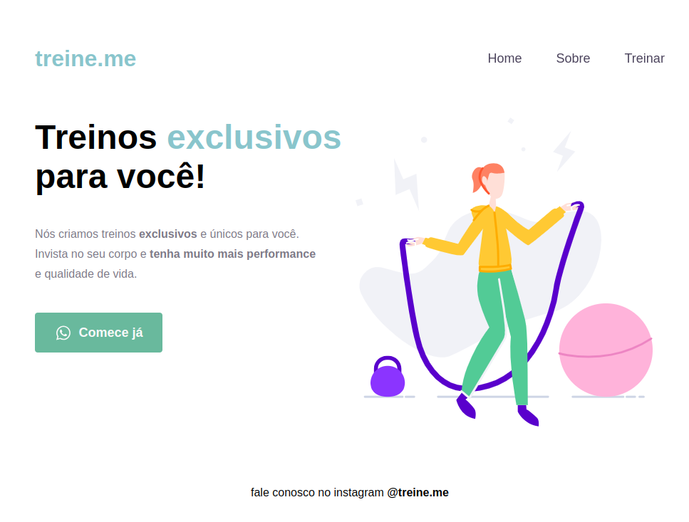

<h1 align="center">Treine.me</h1>

<p align="center">
  <a href="">Projeto</a>&nbsp;&nbsp;&nbsp;|&nbsp;&nbsp;&nbsp;
  <a href="">Tecnologias</a>&nbsp;&nbsp;&nbsp;|&nbsp;&nbsp;&nbsp;
  <a href="">Rodar projeto</a>&nbsp;&nbsp;&nbsp;|&nbsp;&nbsp;&nbsp;
  <a href="">Licença</a>
</p>

<p align="center">
  
</p>

<h2 id="project"> Projeto</h2>

Uma landing page criada exclusivamente para uma acadêmia.



<h2> Tecnologias</h2>

Abaixo as tecnologias que utilizamos para o desenvolvimento do projeto:

> Frontend

- HTML
- CSS
- Vite

<h2 id="usage"> Rodar projeto</h2>

Para rodar o projeto localmente, precisamos ter o `Node.js` e o `npm` instalados.

Siga o passo a passo:

> git clone

```
$ git clone https://github.com/brunogoncalvesferreira/treine.me.git
```

> Acesse a pasta

```
$ cd treine.me
```

> Instale as dependências

```
$ npm install
```

> Executando aplicação

```
$ npm run web
```

<h2 align="license"> Licença</h2>

Este projeto está sob a licença MIT.

<div style="display: flex;">
  <a href="https://www.linkedin.com/in/bruno-goncalves-ferreira/" target="_blank"></a>
  <a href="mailto:brunogoncalveferreira@outlook.com"></a> 
  <a href="https://www.instagram.com/brunogonferreira/" target="_blank"></a>
</div>
